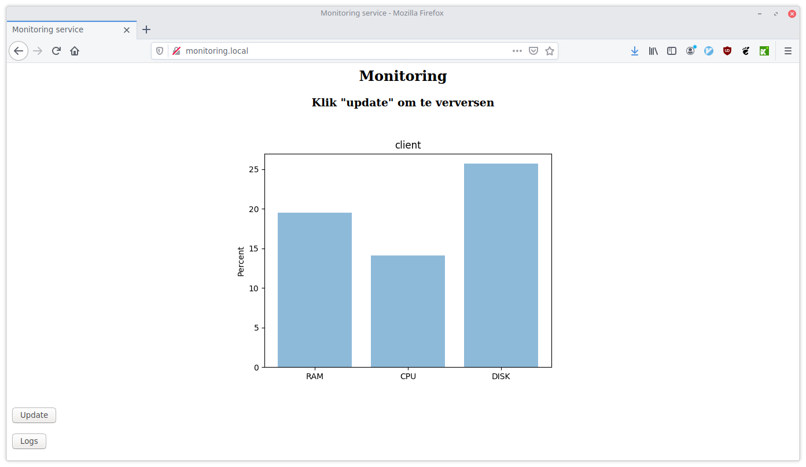

## Herkansing Automation
Dit zijn de scripts die horen bij de herkansing van de cursus Automation.



### Benodigdheden
Om deze scripts te kunnen gebruiken moeten de volgende dependencies geïnstalleerd zijn:

* ```python3``` (voor het draaien van de monitoring scripts)
* ```ansible``` (om de scripts automatisch te provisionen)
* ```docker``` (om de website in een container te draaien)
* ```docker-compose``` (om de container automatisch uit te rollen)
* ```systemd``` (om de scripts te installeren als service)
* ```bash``` (voor het draaien van de scripts)
* ```geckodriver``` (voor het draaien van de Selenium tests)

Je kunt de dependency-check automatisch uitvoeren door gebruik te maken van ```dependencies.sh```; zie de eerste stap in het volgende onderdeel.

### Handleiding
Clone de repository en run ```install.sh``` om het monitoringsysteem automatisch te installeren. Installeer je het liever stap-voor-stap? Volg dan het volgende lijstje:

* stel de juiste client (en optioneel installatie directory) in met behulp van ```config.xml```
* _(optioneel)_ controleer of de juiste dependencies aanwezig zijn op het systeem (```curl -s https://raw.githubusercontent.com/barthakstege/Automation_poging2/master/Scripts/dependencies.sh | bash | column -t```)
* sign de scripts met het ```create_sum.py``` script (```python3 Scripts/create_sum.py```);
* installeer de scripts met de ```scripts.yml``` en ```sysd.yml``` bestanden (```ansible-playbook /root/Automation3/SERVER_CLIENT/scripts.yml && ansible-playbook /root/Automation3/SERVER_CLIENT/sysd.yml```;
* _(optioneel)_ controleer de SHA1 sum op de client (```ssh CLIENT python3 /root/Automation3/SIGNING/check_sum.py```)
* _(optioneel)_ configureer de server met het ```config.py``` script;
* start de lokale systemd service (```cp monitor.service /etc/systemd/system/ && systemctl daemon-reload && systemctl --now enable monitor.service```)
* rol de docker container met de website uit (```docker-compose /root/Automation3/httpd/Docker/docker-compose.yml```)
* bekijk de systeeminfo op de website
* _(optioneel)_ genereer CPU load op de client om de scripts te testen (```while true; do echo "LOAD"; done```) en update de pagina om te zien dat de data up-to-date is
* run de Selenium test om de website te testen (```/usr/bin/python3 /root/Automation3/TESTING/test.py```)

